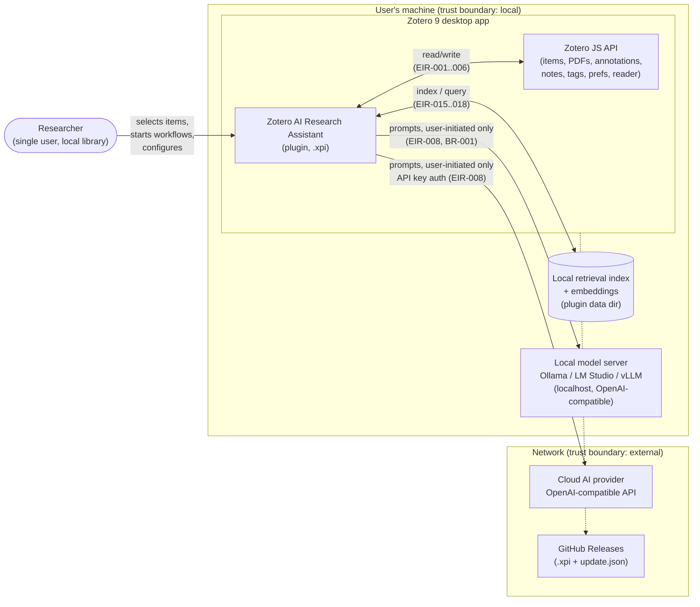

# Architecture Perspective 1 — System Context & Scope

**View type:** Context view (C4 level 1) · **Diagram:** context diagram
**Answers:** What is the system, who/what does it talk to, where are the trust boundaries?

## 1. System in one paragraph

The Zotero AI Research Assistant is a **bootstrapped Zotero 9 plugin** (`.xpi`) that runs
entirely inside the Zotero desktop process. It reads library content (metadata, PDFs,
annotations, notes, tags) through Zotero's JavaScript API, maintains a **local retrieval
index** on disk, and — only on explicit user action (BR-001) — sends composed prompt
context to a **user-configured AI provider** (cloud or localhost). Results come back as
notes, tags, and highlights written as regular Zotero objects.

## 2. Context diagram

## 3. External actors & interfaces

| Actor / system | Direction | Interface | Requirements |
|---|---|---|---|
| Researcher | in | Zotero UI: item context menu, Tools menu, settings pane, result view | NFR-013..018 |
| Zotero JS API | in/out | `Zotero.*` globals, notifier events, `registerPrefPane`, PDF reader annotations | EIR-001..006 |
| OpenAI-compatible providers (cloud **and** localhost) | out | HTTPS/HTTP chat-completions, configurable base URL | EIR-007..014, FR-013..022 |
| Codex / GitHub Copilot | out (conditional) | Only if feasibility spike S1-08 says "go" | FR-014/015, OP-003/004 |
| Local retrieval index | in/out | `RetrievalBackend` interface over files in plugin data dir | EIR-015..018 |
| GitHub Releases | in | Zotero's plugin updater fetches `update.json` from manifest `update_url` | DEP-001 |

## 4. Hard boundary rules (drive everything downstream)

1. **No network without user action.** External AI calls happen only after the user
   explicitly starts a workflow (BR-001, NFR-009). Background indexing is 100 % local
   (BR-002, BR-008, FR-077).
2. **Embeddings and index never leave the device** (NFR-010, MVP-013). Nothing in the
   index path may import the provider layer (enforced: see perspective 2, dependency rules).
3. **Zotero is the authoritative data store** (BR-010). The index is a rebuildable cache
   (BR-009); deleting it loses nothing.
4. **Writes are limited** to notes, tags, and highlight annotations — never collection
   membership or item organization (EIR-006, NFR-022, BR-007).
5. **Secrets stay out of logs, errors, and UI** (NFR-012, DAR-008).

## 5. Top quality drivers (ranked)

| # | Driver | Source | Architectural consequence |
|---|---|---|---|
| 1 | Privacy / local data sovereignty | NFR-007..012 | Trust-boundary split above; provider layer is the *only* network egress |
| 2 | Data safety of the user's library | NFR-019..023 | Adapter is the only Zotero writer; fault-injection-tested write paths |
| 3 | Provider replaceability | NFR-026, EIR-012/013 | `AIProvider` interface + registry; config-only provider switching |
| 4 | Retrieval-backend replaceability | NFR-027, EIR-015 | `RetrievalBackend` interface; fake backend passes same test suite |
| 5 | Token efficiency | NFR-001..004 | RAG context assembly instead of full-document prompts |
| 6 | Offline capability | NFR-028..032 | Every feature classified offline-safe / provider-dependent (perspective 5) |

## 6. Out of scope (context level)

No Zotero sync/server integration, no multi-user features, no cloud vector DB (FR-074),
no standalone semantic search UI (CON-008), no collection analysis in MVP (FR-099..101).
