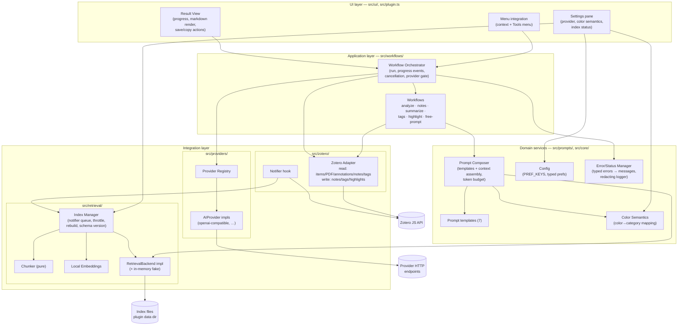

# Architecture Perspective 2 — Component & Module View

**View type:** Building-block view (C4 level 2/3) · **Diagram:** component diagram
**Answers:** What are the parts, what does each own, who may depend on whom?

Maps the recommended components from requirements §15.2 onto the actual `src/` layout.

## 1. Component diagram

## 2. §15.2 component → module map

| §15.2 component | Module | Key contract | Built in |
|---|---|---|---|
| Zotero Adapter | `src/zotero/adapter.ts`, `src/zotero/types.ts` | plain serializable item context; only module touching `Zotero` global | S2-01, S2-06, S4-05, S5-02 |
| AI Provider Manager | `src/providers/` (registry + impls) | `AIProvider` (`validateConfig`, `complete`) in `src/providers/types.ts` | S1-01, S1-03 |
| Prompt Manager | `src/prompts/templates.ts`, composer | template render + `{{context}}` assembly under token budget | S2-03, S3-05 |
| Color Semantics Manager | `src/core/colorSemantics.ts` | pure mapping + (de)serialization; already implemented | S1-07 (UI) |
| Local Index Manager | `src/retrieval/` (index manager, chunker, embeddings) | enqueue/throttle, rebuild, schema versioning | S3-02/03/06/07 |
| Retrieval Engine | `RetrievalBackend` impl | `indexItem` / `removeItem` / `query` / `rebuild` in `src/retrieval/types.ts` | S3-01, S3-04 |
| Workflow Orchestrator | `src/workflows/` | `Workflow.run(context, onProgress)` in `src/workflows/types.ts` | S2-02 |
| Result Renderer | `src/ui/resultView` | progress events in, markdown out, save-as-note action | S2-05 |
| Persistence Manager | `src/core/config.ts` + credential store | `PREF_KEYS`, typed pref helpers, secure key storage | S1-02, S1-04 |
| Error/Status Manager | `src/core/errors.ts` | typed error → user message, `redact()`, namespaced log | S1-09 |

## 3. Dependency rules (allowed imports)

Direction is strictly downward/inward; **no cycles, no skipping the adapter**.

| From \ To | zotero/ | providers/ | retrieval/ | prompts/ | core/ | workflows/ | ui/ |
|---|---|---|---|---|---|---|---|
| **ui/** | — | ✗ (via orchestrator) | status only | ✗ | ✓ | ✓ | ✓ |
| **workflows/** | ✓ | ✓ (interface only) | ✓ (interface only) | ✓ | ✓ | ✓ | ✗ (events out only) |
| **prompts/** | types only | ✗ | interface only | ✓ | ✓ | ✗ | ✗ |
| **retrieval/** | types only | **✗ — never** (NFR-010) | ✓ | ✗ | ✓ | ✗ | ✗ |
| **providers/** | ✗ | ✓ | **✗ — never** | ✗ | ✓ | ✗ | ✗ |
| **zotero/** | ✓ | ✗ | ✗ | ✗ | ✓ | ✗ | ✗ |
| **core/** | ✗ | ✗ | ✗ | ✗ | ✓ | ✗ | ✗ |

Hard invariants behind this table:

- Only `src/zotero/` references the `Zotero` global (grep check in CI, per S2-01).
- `retrieval/` ↔ `providers/` mutually invisible → embeddings physically cannot reach a
  provider request (NFR-010) and indexing cannot trigger network (BR-008).
- Workflows and composer depend on **interfaces** (`AIProvider`, `RetrievalBackend`), never
  concrete classes → provider/backend swap is config-only (NFR-026/027, EIR-012/015).
- UI never calls a provider directly; every AI call funnels through the orchestrator's
  single entry point, which is where BR-001 (explicit user start) is enforced.

## 4. Testability consequence

Everything except `src/zotero/` and `src/ui/` is Zotero-free by construction: composer,
chunker, color semantics, config parsing, error mapping, orchestrator (with fake adapter +
fake provider), and the fake in-memory `RetrievalBackend` all run under vitest without a
Zotero instance. `src/zotero/` and `src/ui/` are covered by documented smoke tests
(`docs/sprints/smoke-tests.md`).
