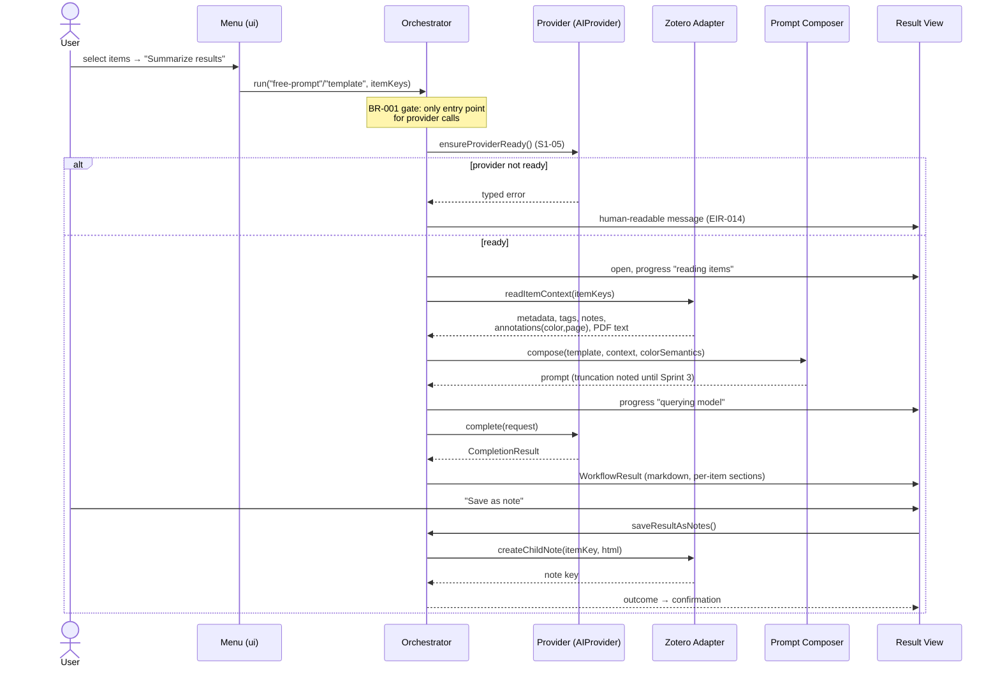
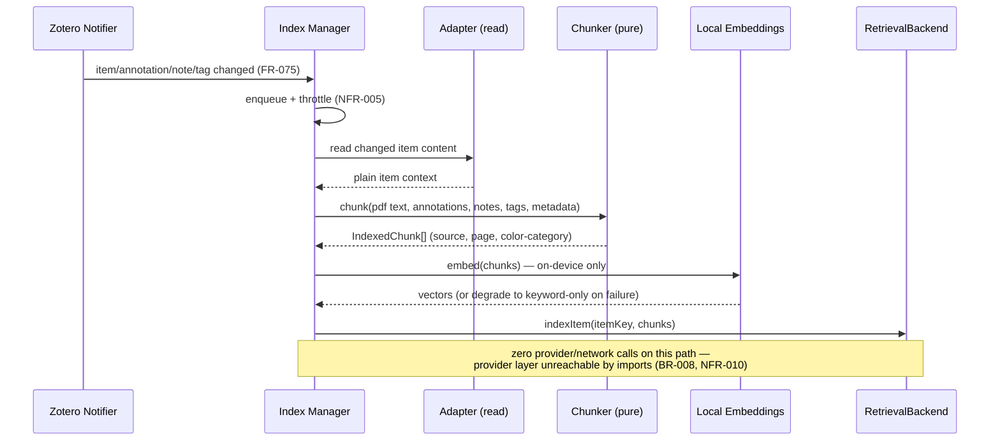
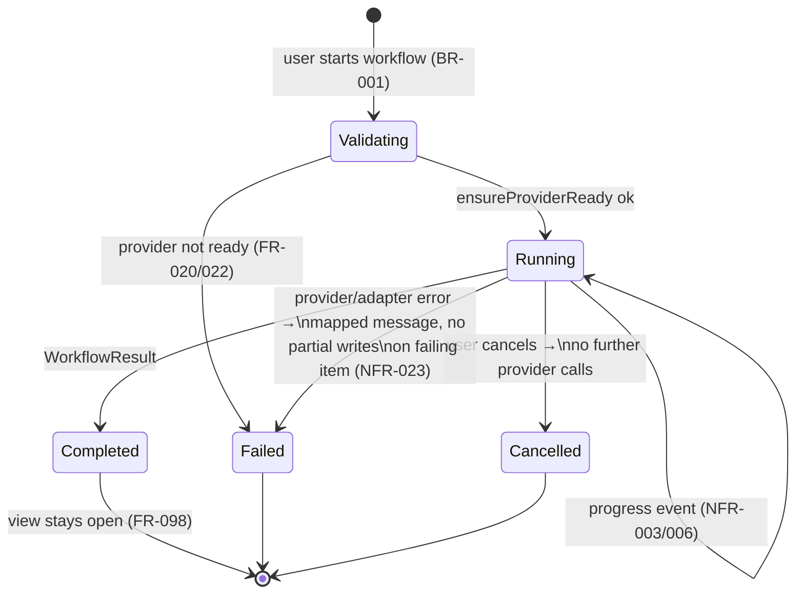

# Architecture Perspective 3 — Runtime & Behavior View

**View type:** Runtime view · **Diagrams:** sequence diagrams + workflow state machine
**Answers:** How do the components collaborate in the key scenarios?

## 1. Scenario: template / free-form prompt workflow (Sprint 2 pipeline)

The thinnest end-to-end slice; every other AI workflow is a variation of it.



Note: the view never calls the adapter directly — saving goes through the
orchestrator (`saveResultAsNotes()`), per the component view's dependency
matrix (ui/ → zotero/ is forbidden).

## 2. Scenario: paper analysis with retrieval (Sprints 3–4)

Difference from scenario 1: the composer pulls **retrieved chunks** instead of truncated
full text, and output is grouped by configured categories.

```mermaid
sequenceDiagram
    participant O as Orchestrator
    participant C as Composer
    participant R as RetrievalBackend
    participant P as Provider
    participant V as Result View

    loop per selected item (progress per paper, NFR-003)
        O->>C: compose(analysis, itemKey)
        C->>R: query({text: category questions,<br/>itemKeys: [item], mode: hybrid})
        R-->>C: top-k chunks (page + color-category metadata)
        Note over C: token budget (NFR-004);<br/>fallback: truncation + notice<br/>if item unindexed
        C-->>O: category-structured prompt
        O->>P: complete()
        P-->>O: per-category summary<br/>("No relevant evidence found"<br/>for empty categories, FR-040)
        O->>V: append per-paper section
    end
```

## 3. Scenario: auto-highlighting (Sprint 5)

The only workflow writing annotations; position strategy comes from spike S2-08.

```mermaid
sequenceDiagram
    participant O as Orchestrator
    participant P as Provider
    participant Res as Position Resolver (pure)
    participant Dup as Duplicate Check (pure)
    participant A as Adapter (write)
    participant V as Result View

    O->>A: read complete PDF page text
    O->>O: pack pages into bounded overlapping chunks (FR-106)
    loop each configured category × text chunk (FR-102/106)
        O->>P: identify relevant passages for one category in this chunk
        P-->>O: exact quotes
    end
    O->>Res: resolve quotes → PDF positions (fuzzy match)
    Res-->>O: positions | unresolved list
    O->>A: read existing highlights + broken fallback notes
    O->>Dup: filter (span overlap ≥ threshold,<br/>user highlights count too, FR-046)
    Dup-->>O: passages to create
    loop per passage
        O->>A: read open-reader character geometry
        A->>A: normalize quote → chars; validate nonzero line rects
        O->>A: createHighlight(position, categoryColor, uniqueKey)
        Note over A: regular Zotero annotation —<br/>user can edit/delete (FR-048)
        opt replacing broken fallback (FR-103..105)
            A->>A: remove old note only after highlight save succeeds
        end
    end
    O->>V: created per category + pages,<br/>unresolved passages reported
    Note over O,V: failure mid-run: created highlights stay valid,<br/>rest reported (NFR-023)
```

`PDFWorker.getFullText()` supplies page text but no character geometry. Geometry
comes from an already-open Zotero PDF reader (`getPageData().chars`). When no
reader geometry is available, the adapter retains one zero-position page-note
fallback. A later run detects it, reserves its span against duplicates, retries
anchoring, and deletes the note only after a valid replacement is saved.

Auto-highlight never uses retrieval passages: exact quoting needs contiguous
source text, and page chunks cover the full PDF deterministically. Therefore
its result never inherits the generic "not indexed / truncated text" notice.
Retrieval-index state continues to govern analysis/template/free-prompt context.

## 4. Scenario: background index update (no user, no network)



Deletion mirrors this with `removeItem(itemKey)`. "Rebuild index" = `rebuild()` then a
full re-enqueue of the library subset (FR-078/079).

## 5. Workflow lifecycle state machine

Shared by all workflows; the orchestrator owns transitions, the result view renders them.



Failure contract for multi-item runs: results already written (notes/tags/highlights on
earlier items) remain valid; the failing item gets no half-written output; remaining items
are reported as skipped (NFR-023, fault-injection-tested in S4-06).

## 6. Concurrency model

Single-threaded JS inside Zotero; long operations are `async` with progress callbacks.
Rules: (1) one AI workflow at a time — orchestrator rejects a second start while running;
(2) index updates run in background between workflow steps (throttled queue), never during
`rebuild()`; (3) cancellation is cooperative — checked before each provider call and each
per-item step.
