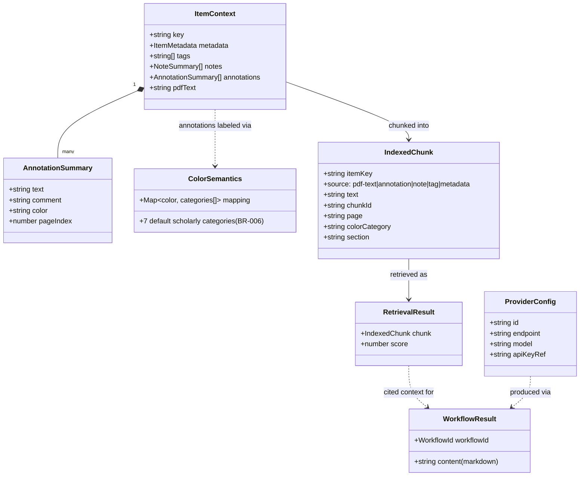
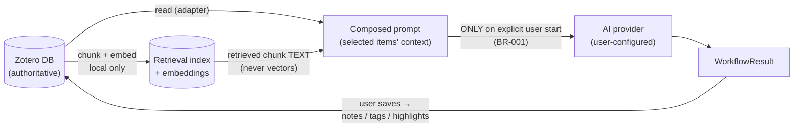

# Architecture Perspective 4 — Data & Persistence View

**View type:** Data view · **Diagrams:** data model (class diagram) + storage map
**Answers:** What data exists, where does it live, who owns it, what may leave the device?

## 1. Core data model

Plain serializable types only — Zotero objects never cross the adapter boundary (S2-01).

(`chunkId`/`page`/`colorCategory`/`section` on `IndexedChunk` are Sprint 3
extensions of the original stub, per S3-02. `page` is a string reader page
label — not a numeric index — since PDF page labels can be roman numerals.)

## 2. Storage map

| Store | Location | Content | Owner / authority | Lifecycle | Refs |
|---|---|---|---|---|---|
| **Zotero DB** | Zotero profile (`zotero.sqlite` + storage) | items, PDFs, annotations, notes, tags — including everything the plugin writes | **Zotero — authoritative** (BR-010) | managed by Zotero; plugin writes are regular objects (FR-048/056) | EIR-001..006, DAR-010 |
| **Prefs** | `extensions.zotero-agent.*` in Zotero prefs | provider endpoint/model/active id, color semantics (serialized), feature flags, token budget | plugin (`PREF_KEYS` in `src/core/config.ts` — single source of key names) | survives restart; invalid values → safe defaults | DAR-002/006/007, OP-006 (decided) |
| **Credential store** | Zotero login manager (secure storage); prefs fallback documented | API keys, referenced from config via `apiKeyRef` | plugin | updatable/removable in settings; never logged (`redact()`) | FR-019, DAR-008, NFR-011/012 |
| **Retrieval index** | plugin data dir (`Zotero.DataDirectory`/zotero-agent/) | chunks, embeddings, schema-version marker | plugin — **rebuildable cache** (BR-009) | delete anytime → rebuild from Zotero (FR-078); version mismatch → rebuild prompt (NFR-021) | DAR-003/004/005, EIR-018, CON-007 |
| **Generated results (unsaved)** | memory only (result view) | `WorkflowResult` markdown | plugin | gone on close unless saved as note (FR-093/096) | FR-091..098 |

Nothing else is persisted. Explicitly: **no full PDF copies outside the index cache**
(DAR-009), no plugin-proprietary note format (FR-056, BR-004), no cloud storage (FR-074).

## 3. Data flow & privacy classification

| Data class | May leave device? | Condition |
|---|---|---|
| Chunk **text** of user-selected items, composed into a prompt | yes | only to the user's configured provider, only after explicit workflow start (BR-001, NFR-009) |
| Embeddings, index files, similarity scores | **never** (NFR-010, MVP-013) | enforced structurally: `retrieval/` cannot import `providers/` |
| API keys | never in logs/UI (NFR-012) | sent only as auth header to their own provider endpoint |
| Whole library / unselected items | never | context is always built from the user's selection (DAR-001) |
| Telemetry | never | none exists (out of scope) |

## 4. Consistency & lifecycle rules

1. **Index freshness:** Zotero notifier events (item/attachment/annotation/note/tag)
   enqueue re-indexing; throttled background processing (FR-075..077). Source of truth on
   any conflict: Zotero (BR-010) — re-read, re-chunk, overwrite index entries.
2. **Deletes:** item deleted in Zotero → `removeItem(itemKey)`; index never resurrects data.
3. **Schema evolution:** index carries a schema-version marker; incompatible version →
   prompt to rebuild instead of erroring (NFR-021). No index migrations — rebuild *is* the
   migration (cheap by design, BR-009).
4. **Config evolution:** unknown/invalid pref values fall back to typed defaults (S1-02);
   color-semantics parsing round-trips via `serializeColorSemantics`/`parseColorSemantics`.
5. **Write idempotency:** tag writes dedupe case-insensitively (FR-064); highlight writes
   dedupe by span overlap (FR-046); note saves create explicit new notes, never silent
   edits of user notes (NFR-019).
