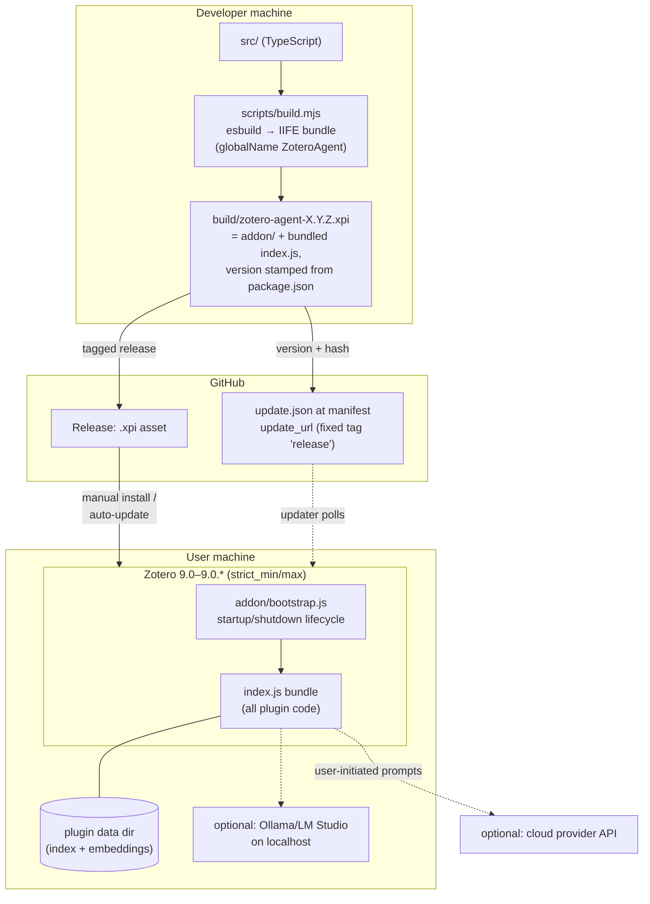

# Architecture Perspective 5 — Deployment & Cross-Cutting Concerns

**View type:** Deployment view + cross-cutting concepts · **Diagram:** deployment diagram
**Answers:** How is it built, shipped, updated, and which concepts apply everywhere?

## 1. Deployment diagram

## 2. Build & release pipeline (S5-05)

| Step | Tool | Notes |
|---|---|---|
| typecheck + unit tests | `tsc --noEmit`, vitest | gate for every change |
| bundle | esbuild (IIFE, single `index.js`) | Zotero has no module loader for plugins |
| package | zip `addon/` + bundle → `.xpi` | version single-sourced from `package.json` |
| publish | GitHub release (tag `vX.Y.Z`) + refresh `update.json` under fixed `release` tag | `update_url` in `manifest.json` is **mandatory** in Zotero release builds — its absence was the Sprint-0 install failure |
| verify | fresh Zotero 9 profile: install via README, updater sees new version | S5-05 acceptance |

Runtime constraints inherited from the platform: bootstrapped plugin (no XUL overlay),
`manifest_version 2`, all UI created/removed in `startup`/`shutdown` — menu items and
pref panes must be cleaned up on shutdown to survive plugin reload (S2-07).

## 3. Cross-cutting concepts

### 3.1 Error handling & status (S1-09)

- **Typed errors** at the source (`ProviderUnavailableError`, auth, unknown-model,
  adapter write failures) → one central mapper → user-readable messages (EIR-014).
  Raw stack traces never reach the UI.
- **Progress**: orchestrator emits `started/step/finished/failed`; result view and index
  status UI consume the same event shape (NFR-003/006). Indexing status is visually
  distinct from AI activity (FR-076).
- **Logging**: `Zotero.debug` namespaced `[zotero-agent]`; every log/error path routes
  through `redact()` so credentials cannot leak (NFR-012).

### 3.2 Security & privacy controls

| Control | Mechanism | Verified by |
|---|---|---|
| No unsolicited AI calls | single orchestrator entry point gated on user action (BR-001) | review checklist + orchestrator tests |
| Embeddings stay local | `retrieval/` ⊥ `providers/` import ban (NFR-010) | dependency-rule grep + unit test on request builder |
| No secrets in logs/UI | `redact()` on all error/log paths | unit test: error containing key never surfaces it |
| Key storage | Zotero login manager, prefs fallback documented | S1-04 smoke test |
| Library write safety | adapter-only writes; notes/tags/highlights only (BR-007, NFR-022) | static check: no collection APIs in adapter |

### 3.3 Offline behavior matrix (NFR-028..032)

| Capability | Offline? |
|---|---|
| Index build/update/query | ✓ fully local (NFR-030) |
| View previously generated notes/results | ✓ (NFR-031) |
| Workflows via localhost model (Ollama) | ✓ (NFR-029) |
| Workflows via cloud provider | ✗ → immediate "provider unavailable — you are offline" (FR-022), no hang |
| Plugin startup, settings, color semantics | ✓ — nothing errors on startup offline (NFR-032) |

### 3.4 Configuration & extensibility

- All tunables behind `PREF_KEYS` (token budget, throttle interval, retrieval limit,
  active provider) — no scattered magic values.
- **New provider** = new class in `src/providers/` + registry entry; zero workflow changes
  (NFR-026). Codex/Copilot slot in here if spike S1-08 says "go".
- **New workflow** = new `Workflow` impl + menu entry; pipeline (gate → adapter → composer
  → provider → result view) is reused.
- **Post-MVP hooks** already shaped for: collection analysis (multi-item context is
  first-class), standalone semantic search (`RetrievalBackend.query` is UI-agnostic),
  streaming responses (`CompletionRequest` shape kept streaming-ready, S1-01).

### 3.5 Testing strategy (pyramid)

| Level | Scope | Runs where |
|---|---|---|
| Unit (vitest) | all pure modules: composer, chunker, color semantics, config, error mapper, dedup logic, orchestrator with fakes | CI, no Zotero |
| Interface contract | same suite against real + fake `RetrievalBackend`; fake provider through registry | CI |
| Fault injection | provider fails on item 2 of 3 → write-safety asserted (S4-06) | CI |
| Smoke (manual, documented) | `.xpi` install, settings persistence, real-provider run, offline pass, highlight rendering | `docs/sprints/smoke-tests.md` |
| Quality eval | rubric-scored fixture papers (S4-08/S5-07) | manual, per prompt change |

## 4. Architecture decision log (seed)

| # | Decision | Status | Where |
|---|---|---|---|
| AD-1 | Prefs-based config storage (OP-006) | decided | S1-02 |
| AD-2 | Target Zotero 9.0–9.0.* (OP-005) | decided | `manifest.json` |
| AD-3 | Default color mapping (OP-008) | decided | `src/core/colorSemantics.ts` |
| AD-4 | Retrieval library & embedding strategy (OP-002) | open → spike S2-09 | `docs/research/retrieval-library-decision.md` |
| AD-5 | Highlight write strategy (OP-001) | open → spike S2-08 | `docs/research/highlight-write-feasibility.md` |
| AD-6 | Codex/Copilot go/no-go (OP-003/004) | open → spike S1-08 | `docs/research/provider-feasibility.md` |

New significant decisions get a row here plus a short rationale file under `docs/research/`.
