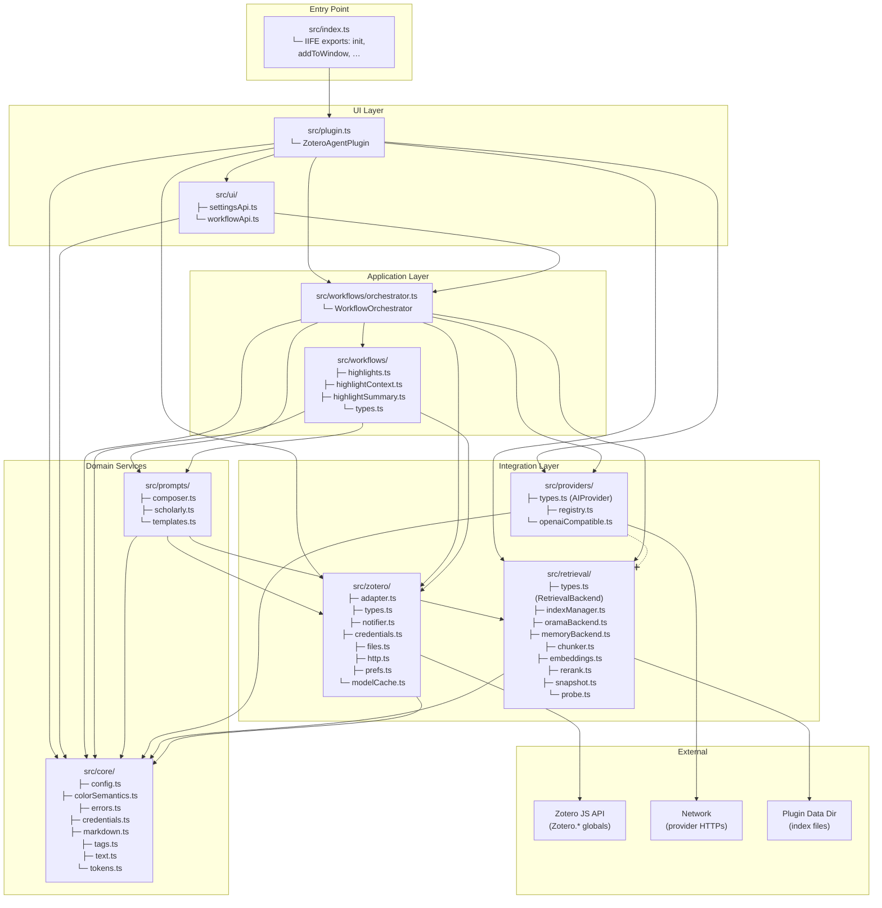
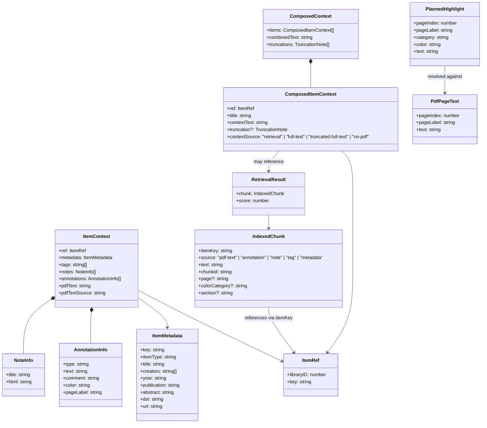
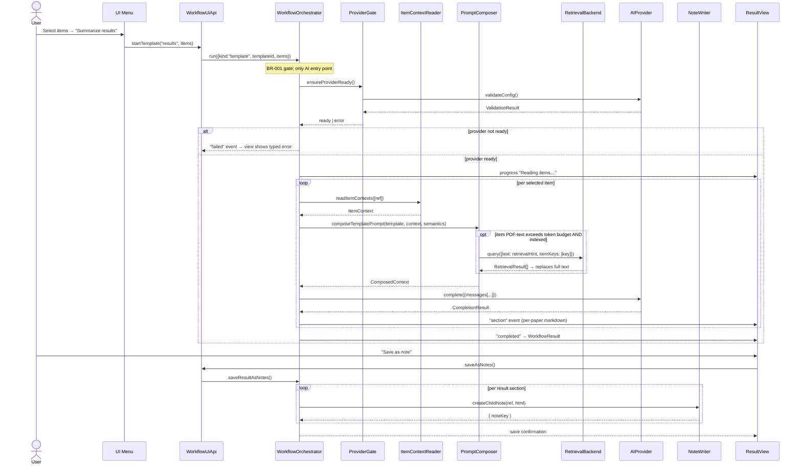
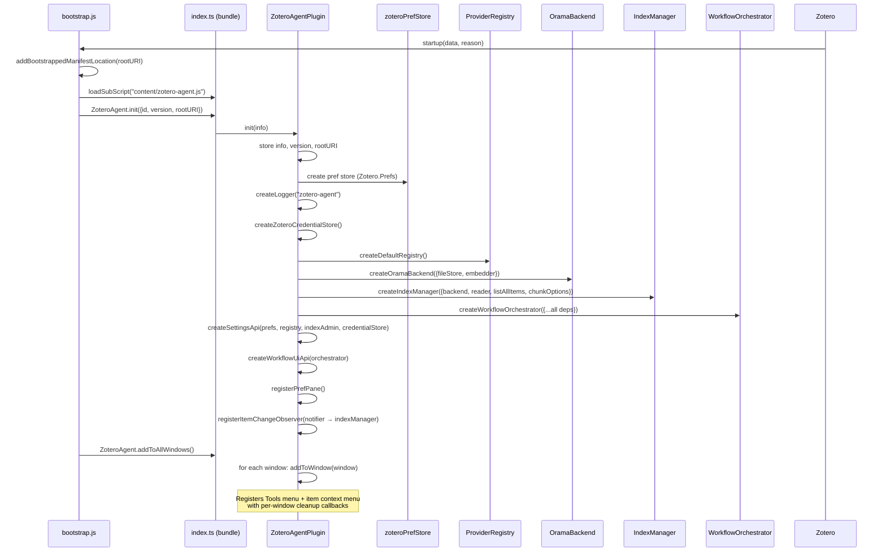
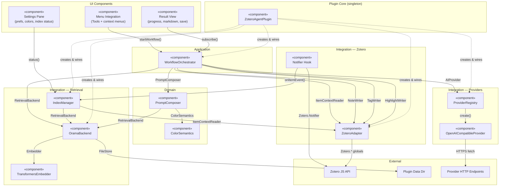
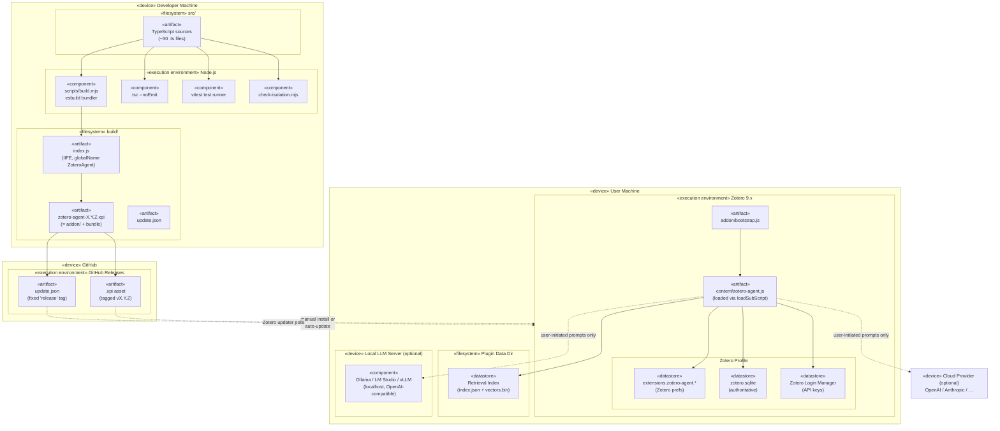

# Holistic Architecture Reference

> **Purpose:** This document provides a single-page, complete architectural overview of
> the Zotero AI Research Assistant plugin. It combines multiple UML perspectives so that a
> new developer can understand the codebase from structure, behaviour, and deployment
> angles without cross-referencing five separate documents.
>
> **Target audience:** Developers onboarding to the project, contributors evaluating
> architectural fit, and reviewers verifying invariants.

---

## Table of Contents

1. [Package Diagram — Module Organisation & Dependency Rules](#1-package-diagram)
2. [Class Diagram — Core Interfaces, Types & Implementations](#2-class-diagram)
3. [Sequence Diagram — Key Runtime Scenarios](#3-sequence-diagrams)
4. [Component Diagram — Runtime Wiring & Injection](#4-component-diagram)
5. [Deployment Diagram — Build, Ship & Update](#5-deployment-diagram)

---

## 1. Package Diagram

> **Perspective:** Logical package structure with dependency direction.
> Arrows read _"depends on"_ — the arrow points from the dependent to the dependency.



### Dependency Rules (Hard Invariants)

| Rule                                                               | Enforcement                                                                                                                                                      |
| ------------------------------------------------------------------ | ---------------------------------------------------------------------------------------------------------------------------------------------------------------- |
| **Only `src/zotero/` touches the `Zotero` global**                 | `scripts/check-isolation.mjs` grep check; all other modules import only plain types from `zotero/types.ts`                                                       |
| **`retrieval/` ⟂ `providers/` — mutually invisible**               | Structural: neither directory imports the other. Embeddings physically cannot reach a network provider (NFR-010); indexing cannot trigger network calls (BR-008) |
| **Workflows depend on interfaces, never concrete implementations** | `AIProvider` and `RetrievalBackend` are injected; provider/backend swap is config-only                                                                           |
| **UI never calls a provider directly**                             | Every AI call goes through `WorkflowOrchestrator.run()` — the single entry point where BR-001 (explicit user start) is enforced                                  |
| **Core (`src/core/`) depends on nothing**                          | Pure functions and plain data; imports nothing outside itself                                                                                                    |

---

## 2. Class Diagram

> **Perspective:** Static structure — interfaces, concrete classes, and their
> relationships. Uses UML notation: `<<interface>>` for abstract contracts,
> hollow-triangle arrows for realisation, filled-diamond for composition,
> open arrow for association.

### 2.1 Core Domain Types & Interfaces

```mermaid
classDiagram
    direction TB

    class AIProvider {
        <<interface>>
        +readonly id: string
        +readonly label: string
        +validateConfig() Promise~ValidationResult~
        +complete(req: CompletionRequest, onChunk?) Promise~CompletionResult~
        +listModels?() Promise~string[]~
        +getModelCapabilities?() Promise~ModelCapabilities~
    }

    class RetrievalBackend {
        <<interface>>
        +indexItem(itemKey, chunks) Promise~void~
        +removeItem(itemKey) Promise~void~
        +query(query: RetrievalQuery) Promise~RetrievalResult[]~
        +rebuild() Promise~void~
        +listIndexedItemKeys() Promise~string[]~
        +stats() Promise~IndexStats~
    }

    class ItemContextReader {
        <<interface>>
        +readItemContexts(refs: ItemRef[]) Promise~ItemContext[]~
    }

    class NoteWriter {
        <<interface>>
        +createChildNote(ref, html) Promise~{ noteKey }~
    }

    class TagWriter {
        <<interface>>
        +setTags(ref, tags) Promise~void~
    }

    class HighlightWriter {
        <<interface>>
        +readHighlightTargets(ref) Promise~HighlightTargets~
        +createHighlights(ref, planned) Promise~HighlightWriteResult~
        +removeFallbackNotes(ref, keys) Promise~void~
    }

    class PrefStore {
        <<interface>>
        +get(key) unknown
        +set(key, value) void
        +clear(key) void
    }

    class CredentialStore {
        <<interface>>
        +getSecret(id) Promise~string | null~
        +setSecret(id, value) Promise~void~
        +removeSecret(id) Promise~void~
    }

    class FileStore {
        <<interface>>
        +readText(name) Promise~string | null~
        +writeText(name, content) Promise~void~
        +readBinary(name) Promise~Uint8Array | null~
        +writeBinary(name, data) Promise~void~
        +remove(name) Promise~void~
    }

    class Embedder {
        <<interface>>
        +dimensions number
        +embed(texts) Promise~Float32Array[]~
        +available boolean
    }

    class Reranker {
        <<interface>>
        +rerank(query, results) Promise~RetrievalResult[]~
    }
```

### 2.2 Concrete Implementations

```mermaid
classDiagram
    direction TB

    class AIProvider {
        <<interface>>
    }

    class OpenAICompatibleProvider {
        +static ID = "openai-compatible"
        +static LABEL = "OpenAI-compatible"
        +id: string
        +label: string
        -settings: ProviderSettings
        -deps: ProviderDeps
        +validateConfig() Promise~ValidationResult~
        +complete(req) Promise~CompletionResult~
    }

    class RetrievalBackend {
        <<interface>>
    }

    class OramaBackend {
        -db: OramaDb
        -embedder: Embedder | null
        -fileStore: FileStore
        -rerank: Reranker
        +indexItem(itemKey, chunks) Promise~void~
        +removeItem(itemKey) Promise~void~
        +query(query) Promise~RetrievalResult[]~
        +rebuild() Promise~void~
        +listIndexedItemKeys() Promise~string[]~
        +stats() Promise~IndexStats~
    }

    class MemoryBackend {
        -chunksByItem: Map~string, IndexedChunk[]~
        -fileStore?: FileStore
        +indexItem(itemKey, chunks) Promise~void~
        +removeItem(itemKey) Promise~void~
        +query(query) Promise~RetrievalResult[]~
        +rebuild() Promise~void~
        +listIndexedItemKeys() Promise~string[]~
        +stats() Promise~IndexStats~
    }

    class TransformersEmbedder {
        +dimensions: number
        +available: boolean
        +embed(texts) Promise~Float32Array[]~
    }

    class ProviderRegistry {
        -factories: Map~string, { label, factory }~
        +register(id, label, factory) void
        +has(id) boolean
        +entries() { id, label }[]
        +create(id, settings, deps) AIProvider
    }

    class IndexManager {
        -backend: RetrievalBackend
        -reader: ItemContextReader
        -listAllItems: () => Promise~ItemRef[]~
        -queue: Map~string, ItemRef~
        -state: IndexState
        +onItemEvent(event) void
        +status() IndexStatus
        +rebuild() void
        +cancelRebuild() void
        +subscribe(listener) () => void
        +load() Promise~void~
        +dispose() void
    }

    OpenAICompatibleProvider ..|> AIProvider
    OramaBackend ..|> RetrievalBackend
    MemoryBackend ..|> RetrievalBackend
    TransformersEmbedder ..|> Embedder
    IndexManager --> RetrievalBackend : uses
    IndexManager --> ItemContextReader : uses
    OramaBackend --> Embedder : optional
    OramaBackend --> FileStore : optional
    OramaBackend --> Reranker : uses
    MemoryBackend --> FileStore : optional
```

### 2.3 Orchestrator & Workflow Types

```mermaid
classDiagram
    direction TB

    class WorkflowOrchestrator {
        +run(request: WorkflowRunRequest) Promise~void~
        +cancel() void
        +isRunning() boolean
        +saveResultAsNotes() Promise~SaveNotesOutcome~
        +subscribe(listener) () => void
    }

    class WorkflowRunRequest {
        <<union>>
        +kind: "template" | "free-prompt" | "analyze-papers" | "auto-highlight" | "generate-notes" | "summarize-notes" | "suggest-tags"
    }

    class WorkflowEvent {
        <<union>>
        +type: "started" | "progress" | "section" | "completed" | "failed" | "cancelled"
    }

    class WorkflowResult {
        +workflowId: WorkflowId
        +content: string
        +sections: WorkflowResultSection[]
        +truncationNotice?: string
    }

    class WorkflowResultSection {
        +ref: ItemRef
        +title: string
        +markdown: string
        +truncated: boolean
    }

    class PromptComposer {
        +composeTemplatePrompt(template, context, options) ComposedContext
        +composeFreePrompt(prompt, context, options) ComposedContext
        +composeAnalysisPrompt(item, semantics, options) string
        +composeHighlightPrompt(item, category, semantics, options) string
        +composeItemContexts(contexts, semantics, options) ComposedContext
    }

    class ColorSemantics {
        +parseColorSemantics(raw) ColorSemantics
        +categoriesForColor(mapping, color) string[]
        +colorForCategory(mapping, category) string
        +configuredCategories(mapping) Category[]
    }

    class ZoteroAdapter {
        +getSelectedItemRefs(window) SelectedItem[]
        +listAllItemRefs(logger) Promise~ItemRef[]~
        +createItemContextReader(logger) ItemContextReader
        +createNoteWriter() NoteWriter
        +createTagWriter() TagWriter
        +createHighlightWriter(logger, credentials) HighlightWriter
    }

    WorkflowOrchestrator --> WorkflowRunRequest : accepts
    WorkflowOrchestrator --> WorkflowEvent : emits
    WorkflowOrchestrator --> WorkflowResult : produces
    WorkflowOrchestrator --> AIProvider : uses
    WorkflowOrchestrator --> RetrievalBackend : uses
    WorkflowOrchestrator --> ItemContextReader : uses
    WorkflowOrchestrator --> NoteWriter : uses
    WorkflowOrchestrator --> TagWriter : uses
    WorkflowOrchestrator --> HighlightWriter : uses
    WorkflowOrchestrator --> PromptComposer : uses
    WorkflowResult *-- WorkflowResultSection
```



### 2.4 Data Model (Value Objects)



### What the Class Diagrams Tell You

- **Every module boundary is an interface.** The orchestrator receives `AIProvider`,
  `RetrievalBackend`, `ItemContextReader`, `NoteWriter`, `TagWriter`, and
  `HighlightWriter` — all injected at construction time. You can swap any of them with a
  fake in tests, or with a new implementation in production, without touching the
  orchestrator.
- **Plain serializable value objects** (`ItemContext`, `IndexedChunk`, `WorkflowResult`,
  etc.) cross module boundaries. Zotero objects never leak past `src/zotero/adapter.ts`.
- **Two mutually invisible layers** (`providers/` and `retrieval/`) are structurally
  prevented from importing each other. The orchestrator is the _only_ code that holds
  references to both, and it never passes one to the other.
- **The orchestration layer is the single chokepoint** for all AI calls (BR-001). Every
  workflow — template, free-prompt, analyze-papers, auto-highlight, generate-notes,
  summarize-notes, suggest-tags — enters through `WorkflowOrchestrator.run()`.

---

## 3. Sequence Diagrams

> **Perspective:** Runtime behaviour — how components collaborate over time in the key
> scenarios. Lifelines are objects (not classes); arrows are method calls or events.

### 3.1 Template / Free-Prompt Workflow (The Thinnest Slice)

Every other AI workflow is a variation of this pattern.



### 3.2 Auto-Highlight Workflow (The Write Path)

The only workflow that writes annotations to Zotero PDFs.

```mermaid
sequenceDiagram
    actor User
    participant Orch as WorkflowOrchestrator
    participant Provider as AIProvider
    participant Reader as ItemContextReader
    participant HW as HighlightWriter
    participant Resolver as HighlightResolver
    participant Dup as DuplicateCheck

    User->>Orch: startWorkflow("auto-highlight", items)

    loop per selected item
        Orch->>Reader: readItemContexts([ref])
        Reader-->>Orch: ItemContext (with pdfText)

        Orch->>HW: readHighlightTargets(ref)
        HW-->>Orch: HighlightTargets (pages, existing highlights)

        Orch->>Orch: createHighlightTextWindows(pages, windowLimit)
        Note over Orch: Exhaustive overlapping windows cut at<br/>paragraph/word boundaries, ≥500-char overlap

        loop per configured category (FR-102)
            opt oversized PDF and indexed
                Orch->>Backend: retrieve category-specific passages
                Backend-->>Orch: rank hints → reorder windows
            end

            loop every window once (FR-106)
                Orch->>Provider: composeHighlightPrompt + complete()
                Provider-->>Orch: exact quotes + categories

                opt context-limit rejection or truncated reply
                    Orch->>Orch: split affected window with overlap
                    Orch->>Provider: retry both halves
                end
            end
        end

        Orch->>Resolver: resolve quotes → PDF positions (fuzzy match)
        Resolver-->>Orch: PlannedHighlight[] + UnresolvedHighlight[]

        Orch->>Dup: filter overlap ≥ threshold vs existing
        Dup-->>Orch: deduplicated PlannedHighlight[]

        loop per planned highlight
            Orch->>HW: createHighlights(ref, [highlight])
            Note over HW: Reads open-reader char geometry,<br/>normalises quote → glyph rects,<br/>creates Zotero annotation
            HW-->>Orch: HighlightWriteResult
        end
    end

    Orch-->>View: created per category + page; unresolved reported
```

### 3.3 Background Index Update (No User, No Network)

Triggered by Zotero's notifier system; 100% local.

```mermaid
sequenceDiagram
    participant Z as Zotero Notifier
    participant IM as IndexManager
    participant Reader as ItemContextReader
    participant Ch as Chunker
    participant Emb as Embedder
    participant Backend as RetrievalBackend

    Z->>IM: item/annotation/note/tag changed (FR-075)
    IM->>IM: enqueue + throttle (2 s debounce, 30 s max wait)
    Note over IM: Single-threaded JS; concurrency = 1;<br/>never blocks Zotero main thread

    IM->>Reader: readItemContexts([ref])
    Reader-->>IM: ItemContext

    IM->>Ch: chunk(itemContext, options)
    Ch-->>IM: IndexedChunk[] (source, page, color-category, section)

    opt embeddings enabled and embedder available
        IM->>Emb: embed(chunk texts)
        Emb-->>IM: Float32Array[] vectors
    end

    IM->>Backend: indexItem(itemKey, chunks)
    Note over Backend: Replaces all previous chunks for itemKey

    IM-->>IM: update status → notify listeners (settings UI)

    Note over IM,Backend: Zero provider/network calls —<br/>providers/ layer unreachable by imports (BR-008, NFR-010)
```

### 3.4 Plugin Startup & Dependency Wiring



### What the Sequence Diagrams Tell You

- **Every AI call passes through exactly one gate:** `WorkflowOrchestrator.run()` is the
  only function that invokes `provider.complete()`. You can grep for `.complete(` and
  confirm it only appears in the orchestrator.
- **The index update path never touches the network.** The sequence shows `IndexManager`
  talking only to `ItemContextReader`, `Chunker`, `Embedder`, and `RetrievalBackend` —
  none of which can reach `AIProvider` because `retrieval/` is forbidden from importing
  `providers/`.
- **Multi-item workflows are resilient.** If item 3 of 5 fails, items 1 and 2 keep their
  results; item 3 gets no half-written output; items 4 and 5 are reported as skipped
  (NFR-023).
- **Zotero writes are adapter-only.** The `NoteWriter`, `TagWriter`, and `HighlightWriter`
  interfaces are the only paths through which the plugin modifies the user's library
  (BR-007, NFR-022).

---

## 4. Component Diagram

> **Perspective:** Runtime component instances and their wiring — how the dependency
> injection graph looks after `ZoteroAgentPlugin.init()` completes. Uses UML component
> notation: lollipop interfaces (provided), socket interfaces (required), solid lines for
> assembly connections.



### Wiring Summary (What `ZoteroAgentPlugin.init()` Does)

| Dependency          | Concrete Implementation                        | Interface                     |
| ------------------- | ---------------------------------------------- | ----------------------------- |
| PrefStore           | `zoteroPrefStore` (Zotero.Prefs)               | `PrefStore`                   |
| CredentialStore     | `createZoteroCredentialStore()`                | `CredentialStore`             |
| Provider Registry   | `createDefaultRegistry()` → `ProviderRegistry` | (concrete)                    |
| Retrieval Backend   | `createOramaBackend({fileStore, embedder})`    | `RetrievalBackend`            |
| Embedder            | `createTransformersEmbedder(...)`              | `Embedder`                    |
| Index Manager       | `createIndexManager({backend, reader, ...})`   | `IndexManager` + `IndexAdmin` |
| Item Context Reader | `createItemContextReader(logger)`              | `ItemContextReader`           |
| Note/Tag Writers    | `createNoteWriter()`, `createTagWriter()`      | `NoteWriter`, `TagWriter`     |
| Highlight Writer    | `createHighlightWriter(logger, credentials)`   | `HighlightWriter`             |
| Orchestrator        | `createWorkflowOrchestrator({...all above})`   | `WorkflowOrchestrator`        |

After wiring, the plugin publishes `Zotero.ZoteroAgent = { settings, workflows, dev? }`
so the settings pane and result view windows (separate JS scopes) can reach plugin logic.

---

## 5. Deployment Diagram

> **Perspective:** Physical deployment — how source code becomes a running plugin on the
> user's machine. Uses UML deployment notation: 3D box = node, rectangle = artifact,
> dashed arrow = communication path.



### Build Pipeline (5 Steps to `.xpi`)

| #   | Step            | Tool                                        | What It Produces                                                      |
| --- | --------------- | ------------------------------------------- | --------------------------------------------------------------------- |
| 1   | Typecheck       | `tsc --noEmit`                              | Pass/fail — gate for every change                                     |
| 2   | Unit tests      | `vitest run`                                | Test report — all pure modules tested without Zotero                  |
| 3   | Isolation check | `node scripts/check-isolation.mjs`          | Verifies `retrieval/` never imports `providers/` and vice versa       |
| 4   | Bundle          | `esbuild` (IIFE, `globalName: ZoteroAgent`) | Single `index.js` — Zotero has no module loader                       |
| 5   | Package         | `zip addon/ + index.js`                     | `zotero-agent-X.Y.Z.xpi` — version single-sourced from `package.json` |

### Runtime Constraints

- **Bootstrapped plugin** (no XUL overlay): all UI created in `startup()`, cleaned up in
  `shutdown()`. Menu items and pref panes must survive plugin reload (S2-07).
- **`manifest_version 2`** with `strict_min_version`/`strict_max_version` pinned to
  Zotero 9.x.
- **`update_url` in `manifest.json`** is mandatory in Zotero release builds for
  auto-update to work (Sprint-0 lesson learned).
- **Separate JS scopes:** The settings pane (`preferences.xhtml`) and result view
  (`resultView.xhtml`) run in their own windows/contexts and communicate with the plugin
  through `Zotero.ZoteroAgent.*` globals published by the plugin during startup.
- **Chrome package registration:** `addBootstrappedManifestLocation()` + `chrome.manifest`
  maps `chrome://zotero-agent-view/content/...` to the addon's `content/` directory so
  XUL windows can load from a packed `.xpi`.

---

## Cross-Reference: Where Each Requirement Lives in Code

| Requirement ID | What                                     | Where Implemented                                                                                  |
| -------------- | ---------------------------------------- | -------------------------------------------------------------------------------------------------- |
| BR-001         | No AI calls without explicit user action | `src/workflows/orchestrator.ts` — single entry point; `src/ui/workflowApi.ts` — menu-only triggers |
| BR-002         | Background indexing is 100% local        | `src/retrieval/indexManager.ts` — no provider imports possible                                     |
| BR-007         | Plugin writes only notes/tags/highlights | `src/zotero/adapter.ts` — `NoteWriter`, `TagWriter`, `HighlightWriter` are the only write seams    |
| BR-009         | Index is a rebuildable cache             | `src/retrieval/oramaBackend.ts` — `rebuild()` drops everything and re-indexes                      |
| BR-010         | Zotero is authoritative                  | `src/retrieval/indexManager.ts` — re-reads from Zotero on conflict                                 |
| NFR-010        | Embeddings never leave device            | Structural: `retrieval/` cannot import `providers/` — enforced by `check-isolation.mjs`            |
| NFR-012        | No secrets in logs/UI                    | `src/core/errors.ts` — `redact()` on all log/error paths                                           |
| NFR-026        | Provider replaceability                  | `src/providers/types.ts` — `AIProvider` interface; `src/providers/registry.ts` — factory pattern   |
| NFR-027        | Retrieval backend replaceability         | `src/retrieval/types.ts` — `RetrievalBackend` interface; `MemoryBackend` passes same test suite    |
| FR-035         | User selects items for analysis          | `src/zotero/adapter.ts` — `getSelectedItemRefs()`                                                  |
| FR-075         | Index updated on Zotero changes          | `src/retrieval/indexManager.ts` — `onItemEvent()` → throttled queue                                |
| FR-080         | Prompt template library                  | `src/prompts/templates.ts` — `PROMPT_TEMPLATES` array (7 scholarly templates)                      |

---

_Document version: matches `main` branch as of 2026-07-17. Regenerate when the module
structure or dependency rules change._
